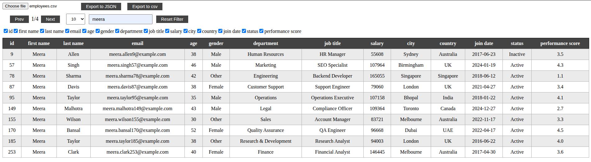
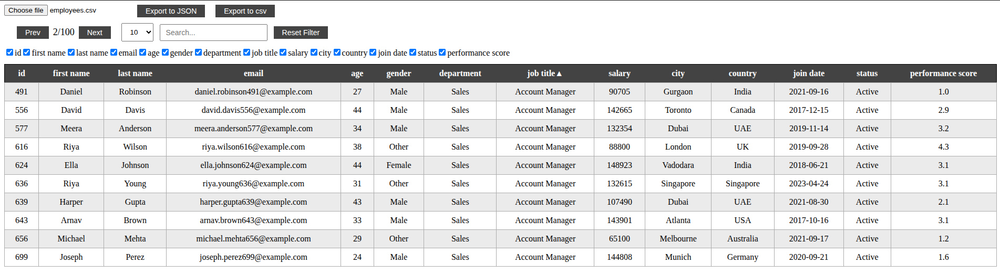
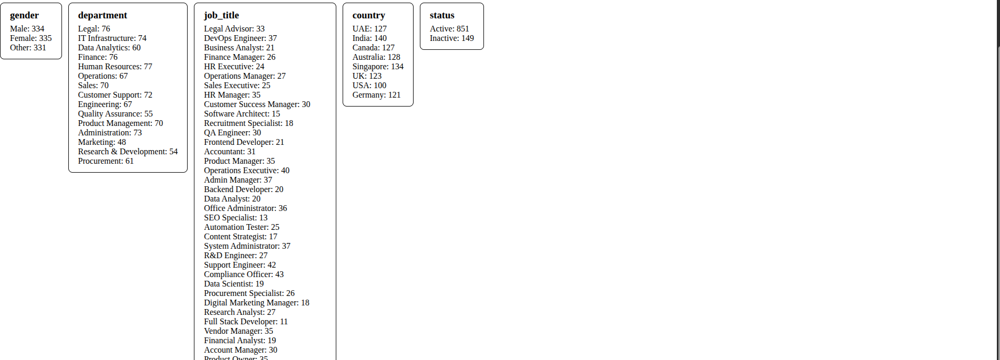

# CSV Reader
A lightweight CSV Reader built with HTML, CSS, and JavaScript that allows users to upload and explore CSV data interactively. The application provides features like pagination, searching, sorting, column visibility control, data export, and statistics, making it easier to analyze CSV files directly in the browser.
## Features
### 1. Upload CSV File
- Users can upload a CSV file from their local system.
- The application parses the CSV and renders the data in a table.
### 2. Data Table
- Displays CSV data in a structured table format.
- Automatically generates columns based on the CSV headers.

### 3. Pagination
- Large datasets are divided into pages.
- Users can navigate through pages easily.

### 4. Searching / Filtering
- Users can search across the dataset.
- Table updates dynamically based on the search query.

### 5. Sorting
- Columns can be sorted in ascending or descending order.
- Sorting works together with pagination and filtering.

### 6. Column Visibility Control
- Users can show or hide specific columns.
- Helps focus on relevant data.

### 7. Row Details Modal
- Clicking a row opens a modal popup.
- Displays detailed information about the selected record.

### 8. Export Data
Users can export the processed dataset into:
- CSV format
- JSON format
### 9. Reset Functionality
Reset button clears:
- Filters
- Sorting
### 10. Statistics
- Displays statistics for selected fields.

## Project Structure
```bash
project-folder
│
├── index.html
├── style.css
├── script.js
├── README.md
├── employees.csv
└── assets
    └── screenshots
└── js
    └── CSVParser.js
    └── TableManager.js
```